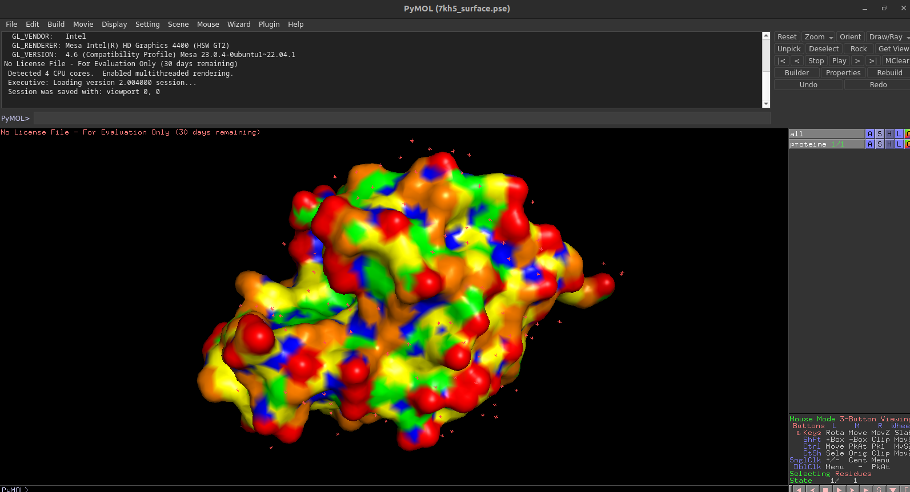

# SASA (Solvent Accessible Surface Area)

 Program to calculate the Solvent-Accessible Surface Area (SASA) of a protein.   
 Give the the area in Square Angstrom for each atom and for the protein.   
 This program is devide in three scripts python :   
 - main.py, to run the program 
 - sasa.py, with all functions to compute the SASA
 - sasa_stat.py, with all functions to build statisticals graphs or pymol files

The methode use to compute the SASA is based about this article :   
[Environment and Exposure to Solvent of Protein Atoms. Lysozyme and Insulin](https://pubmed.ncbi.nlm.nih.gov/4760134/)   
by  A.Shrake and J A Rupley

## Setup your environnement 

Clone the repository   
```sh
git clone https://github.com/ElouanBethuel/SASA.git
```
Move to the project directory   
```sh
cd SASA
```
Install [conda](https://docs.conda.io/en/latest/)   
Install mamba 
```
conda install mamba -n base -c conda-forge
```
Create and activate the conda environnement   
```sh
conda env create -f sasa_project.yml
conda activate sasa_project 
``` 
<br>

## Run the program
Run with the program :  
```sh
python main.py 7kh5 100
```
Execute the script main.py with the pdf file 7kh5.pdb and with 100 points to model the solvation sphere.   
You can replace 7kh5 by any another PDB ID. This program work with many PDB files.If the PDB file format is not compatible an error message is raise.   

To create also graphics and pymol files for visualisation add the argument -s

```sh
python main.py 7kh5 100 -s 
```

<br>

## Outputs

IIn the shell, the Solvent Accessible Surface Area of the protein is displayed :

```
Calculates the solvent accessible surface area from the 7kh5 PDB file :

Downloading the PDB file	
Loading the PDB file

Downloading PDB structure '7kh5'...


Calculation ongoing, please wait a few seconds...

=================
Final result :	
The solvent accessible surface area of the protein : 6503.51 Ų 
```

### Files generated

With by default arguments : 
- The pdb file 
- A text file with the solvent accessibility of each atom   

<br> 

With additional arguments (-s) : 
- A png file (graph) to visualize the points created around a atom
- A png file (graph) showing solvent accessibility by atom category
- A png file (graph) showing solvent accessibility by amino acid category
- A pymol file for showing the accessibility of the protein surface
- A pymol file for showing the neighbors selection 

### This files are stored in two folders
- Outputs : for stored all outputs
- PDB :  for stored all pdb files

### The file name format is always the same (exemple with the 7kh5 pdb ID)
- pdb file : pdb7kh5.ent (pdb + pdb_id + .ent)
- png file : pdb_id + name_file + .png 
- texte file : pdb_id + .txt 
- pymol file (neihgbors) : pdb_id + _neighbors.pse 
- pymol file (surface) : pdb_id + _surface.pse

### To visualize pymol files with the shell 
```sh 
pymol outputs/7kh5_surface.pse 
```


This image shows the 7kh5 protein with its surface coloured according to its accessibility to the solvent: the blue parts are the least accessible and the red ones the most accessible. 

<br>

## Results 

### Comparison of our program results with those of PDBePISA  

According to the website https://www.ebi.ac.uk/pdbe/pisa/ :  PDBePISA (Proteins, Interfaces, Structures and Assemblies) is an interactive tool for the exploration of macromolecular interfaces.

<br>

With **20 points** by atoms to model the solvation sphere : 

| PDB ID | SASA         | PDBePPISA   | percentage difference |
|--------|--------------|-------------|------------------|
| 3i40   |  3644.85 Ų  | 4902.6 Ų   | 34.5 %           |
| 7kh5   |  6821.96 Ų  | 6346.1 Ų   | 6.9 %            |
| 3wgt   |  28621.66 Ų | 31243.3 Ų  | 8.1 %            |
| 3rt9   |  21911.93 Ų | 22296.2 Ų  | 1.7 %            |
| 1us7   |  21904.68 Ų | 23019.5 Ų  | 4.8 %            |  

<br>

With **400 points** by atoms to model the solvation sphere :

| PDB ID | SASA        | PDBePISA    | Percentage difference |
|--------|-------------|-------------|------------------|
| 3i40   | 3727.46 Ų  | 4902.6 Ų   | 31.5 %           |
| 7kh5   | 6563.24 Ų  | 6346.1 Ų   | 3.3 %            |
| 3wgt   | 29599.49 Ų | 31243.3 Ų  | 5.5 %            |
| 3rt9   | 22202.34 Ų | 22296.2 Ų  | 0.42 %           |
| 1us7   | 22182.53 Ų | 23019.5 Ų  | 3.7 %            |


We can see that the higher the number of points, the better the performance.   
In addition, performance is much better for medium and large proteins than for small ones (3i40 for example).  

---